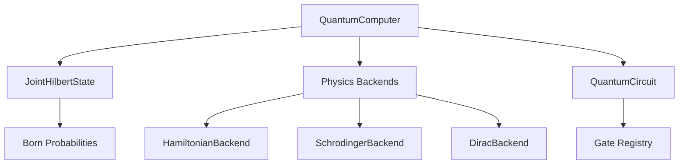

# Introduction to QC

QC (Quasi Quantum Computing) is a quantum circuit simulator that uses neural network physics backends to simulate quantum systems on classical hardware. Unlike traditional quantum simulators, QC leverages three independently trained neural networks to model quantum mechanical evolution through different physical formulations.

## What is QC?

QC is a **collapse-free quantum computer simulator** that maintains quantum states in the full joint Hilbert space without wavefunction collapse. The simulator represents n-qubit states as tensors in C^(2^n) and uses neural network backends trained on physics principles to evolve quantum states.

The key innovation is that measurement is **non-destructive** - the simulator reads Born probabilities without collapsing the quantum state, allowing you to observe quantum systems while preserving their coherence.

## Key Innovations

### Neural Physics Backends

QC implements three independently trained neural network backends, each modeling quantum evolution through a different physical formulation:

<CardGroup cols={3}>
  <Card title="Hamiltonian Backend" icon="atom">
    Spectral convolution network that applies a learned Hamiltonian operator H|ψ⟩ using Fourier-domain operations
  </Card>
  <Card title="Schrödinger Backend" icon="wave-square">
    2-channel network trained to propagate wavefunctions according to the Schrödinger equation
  </Card>
  <Card title="Dirac Backend" icon="arrow-up-right-dots">
    8-channel relativistic network operating on 4-component spinors for Dirac equation evolution
  </Card>
</CardGroup>

### Constraint Preservation

The backends preserve fundamental quantum mechanical constraints without explicit enforcement:

- **Phase coherence**: 22/22 phase coherence tests passed
- **Unitarity**: Norm preserved across all gate operations  
- **Entanglement**: True multi-qubit entanglement with joint Hilbert space representation
- **Response properties**: Electric polarizability matches exact diagonalization with zero error

<Note>
All three backends produce **identical results** across standard quantum algorithms, demonstrating structural consistency beyond simple constraint satisfaction.
</Note>

## Architecture Overview

### State Representation

The quantum state is stored as a tensor of shape `(2^n, 2, G, G)`:

- **Dimension 0**: Computational basis index k ∈ \{0, ..., 2^n - 1\}
- **Dimension 1**: Complex channels (real, imaginary)  
- **Dimension 2-3**: Spatial wavefunction grid (G × G points)

Each amplitude αₖ is encoded as a 2D spatial wavefunction on a 16×16 grid. Born probabilities are computed by integrating the squared modulus over the spatial grid:

```python
P(k) = ∫∫ |αₖ(x,y)|² dx dy
```

This representation correctly supports:
- **Superposition**: Multiple basis states with non-zero amplitude
- **Entanglement**: Amplitudes do not factorize across qubits
- **Coherent gates**: Exact permutation and mixing of amplitudes

### Component Structure



<Steps>
  <Step title="State Initialization">
    Create quantum state in computational basis using `JointStateFactory`
  </Step>
  <Step title="Circuit Construction">
    Build gate sequence with `QuantumCircuit` using quantum gates (H, CNOT, etc.)
  </Step>
  <Step title="Backend Selection">
    Choose physics backend: hamiltonian, schrodinger, or dirac
  </Step>
  <Step title="Execution">
    Apply gates sequentially using selected backend's evolution operators
  </Step>
  <Step title="Measurement">
    Non-destructive Born-rule readout of probability distribution
  </Step>
</Steps>

## Validated Results

QC has been experimentally validated across multiple domains:

### Quantum Algorithms
- **Bell States**: P(|00⟩) = 0.5, P(|11⟩) = 0.5, entropy = 1 bit
- **GHZ States**: Perfect 3-qubit entanglement
- **Grover's Algorithm**: 94.53% success probability on marked state |101⟩
- **Quantum Fourier Transform**: Uniform distribution across 8 basis states

### Molecular Simulation
- **H₂ Ground State**: VQE recovers 100% of correlation energy
- **Error**: |VQE - FCI| = 1.31×10⁻¹¹ Ha (machine precision)
- **Stark Effect**: Electric polarizability α = 2.750 a₀³ (exact match with reference)

### Extended Capabilities
- **Polyatomic molecules**: H₂O, NH₃, CH₄ processed through same pipeline
- **QED corrections**: Anomalous magnetic moment with 0.3% relative error
- **Visualization**: Publication-quality figures matching numerical logs

<Warning>
QC is a research simulator designed for quantum algorithm development and validation. It scales to ~8 qubits on classical hardware due to the 2^n dimensional Hilbert space.
</Warning>

## Use Cases

QC is ideal for:

- **Quantum algorithm prototyping**: Test quantum circuits before running on real hardware
- **Educational demonstrations**: Visualize quantum state evolution without collapse
- **Molecular chemistry**: VQE-based ground state calculations for small molecules
- **Method validation**: Compare neural backend results with analytical solutions

## What's Next?

<CardGroup cols={2}>
  <Card title="Installation" icon="download" href="/installation">
    Install QC and set up your environment with all dependencies
  </Card>
  <Card title="Quick Start" icon="rocket" href="/quickstart">
    Run your first quantum simulation in minutes
  </Card>
</CardGroup>
